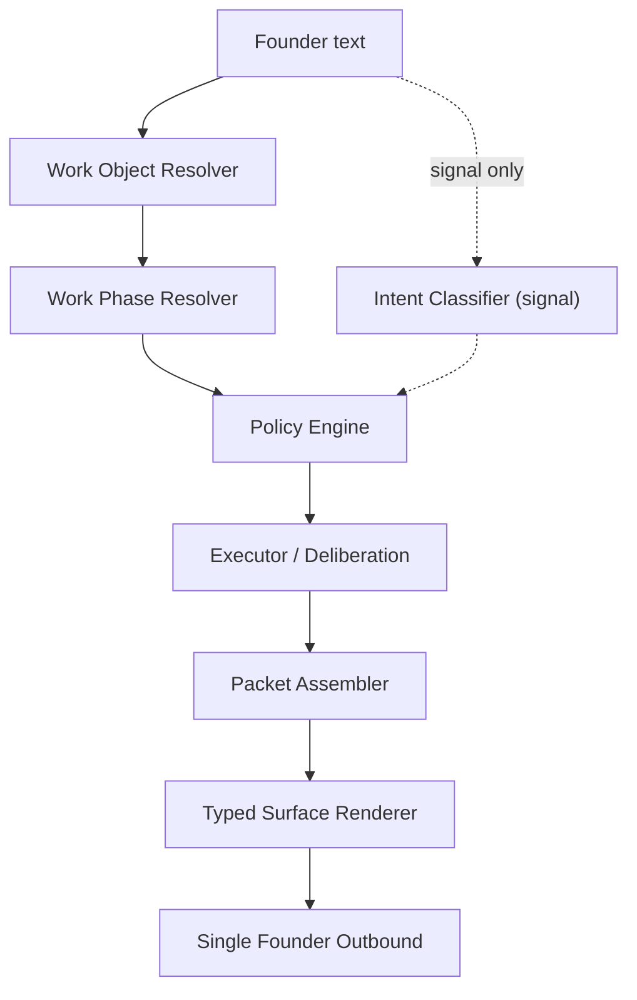

# COS Constitution v1.1 — Work-State-First Chief of Staff OS

## 현행 상태 (v1에서 이미 작성된 것)


| 파일                                         | 상태                  | v1.1 처리                                           |
| ------------------------------------------ | ------------------- | ------------------------------------------------- |
| `docs/architecture/COS_CONSTITUTION_v1.md` | 작성 완료               | v1.1로 **전면 재작성**                                  |
| `src/core/founderContracts.js`             | 작성 완료               | WorkPhase, PolicyContext 등 **대폭 확장**              |
| `src/core/founderIntentClassifier.js`      | 작성 완료               | **보조 signal로 강등** (이름 유지, pipeline에서 1급이 아닌 2급으로) |
| `src/core/founderAuthority.js`             | 작성 완료               | **삭제 → policyEngine.js로 교체**                      |
| `src/core/founderSurfaceRegistry.js`       | 작성 완료               | OS surfaces 추가로 **확장**                            |
| `src/core/founderRenderer.js`              | 작성 완료               | OS surface 렌더러 추가로 **확장**                         |
| `src/core/founderOutbound.js`              | 작성 완료               | **유지** (카운터 지시서도 인정)                              |
| `src/core/internalDeliberation.js`         | 작성 완료               | **유지** (카운터 지시서도 인정)                              |
| `src/core/founderRequestPipeline.js`       | 작성 완료               | **전면 재작성** (work-state-first로)                    |
| `app.js`                                   | pipeline import 추가됨 | pipeline 호출 시그니처 변경 필요                            |


## 핵심 아키텍처 변경 (v1 → v1.1)




**중심축**: intent(보조) → **work_object → work_phase → policy → packet → surface**

---

## 기존 레포에 이미 존재하는 1급 도메인 객체 (발명 불필요, 승격만 필요)

- **ProjectSpace** (`projectSpaceRegistry.js`): `project_id`, `active_run_ids`, `owner_thread_ids` — `current_phase` 필드만 추가 필요
- **ExecutionRun** (`executionRun.js`): `current_stage`(execution_running/deploy_ready/...), `deploy_status`, workstream lanes
- **IntakeSession** (`projectIntakeSession.js`): `stage`(active/execution_ready/approval_pending/.../completed)
- **Packets**: ExecutionPacket(EPK-), DecisionPacket(PKT-), StatusPacket(STP-)
- **Approvals** (`approvals.js`): `pending/approved/on_hold/rejected`

**Golden Path (이미 구현됨)**:
`startProjectKickoffDoor` → `projectIntakeSession(active)` → `scopeSufficiency` → `startProjectLockConfirmed` → `createExecutionPacket+Run` → `executionDispatchLifecycle` → `executionSpineRouter` → deploy

---

## Phase A — Constitution v1.1 문서 재작성

`[docs/architecture/COS_CONSTITUTION_v1.md](docs/architecture/COS_CONSTITUTION_v1.md)` 전면 재작성:

변경 핵심:

- §4 Authority model → **Policy Engine** (actor + work_state + risk_class + capability)
- §5 Surface registry → **Meta/Utility + OS Surfaces + Executive Surfaces** 3계층
- §6 Pipeline → **Work Object Resolver → Phase Resolver → Policy → Executor → Packet Assembler → Renderer → Outbound**
- §8 Failure policy → `unknown_exploratory` → `discovery_surface` vs `unknown_invalid` → `safe_fallback_surface`
- §10 Migration → **golden-path-first** (kickoff→lock→execute→deploy 전체를 먼저 이관)

---

## Phase B — Core Modules 재구성 (신규 4 + 수정 4 + 유지 2 + 삭제 1)

### 신규 생성

- `**src/core/workObjectResolver.js**` — founder input이 어느 work object에 속하는지 해석
  - 기존 `projectSpaceResolver.resolveProjectSpaceForThread` + `projectIntakeSession.isActiveProjectIntake/hasOpenExecutionOwnership` + `executionRun.getExecutionRunById` 래핑
  - 반환: `{ resolved, project_space?, run?, intake_session?, phase_hint, confidence }`
- `**src/core/workPhaseResolver.js**` — unified work phase 결정
  - 기존 IntakeStage + ExecutionRun.current_stage를 아래 통합 모델로 매핑:
    ```
    discover → IntakeStage 없음 + 탐색적 입력
    align    → IntakeStage='active' (pre-lock)
    lock     → scopeSufficiency.sufficient + proceed signal
    seed     → IntakeStage='execution_ready'
    execute  → IntakeStage='execution_running' / Run.current_stage='execution_running'
    review   → IntakeStage='execution_reporting' / Run.current_stage completion
    approve  → IntakeStage='approval_pending' / Run.deploy_status='awaiting_founder_action'
    deploy   → Run.current_stage='approved_for_deploy' or deploy_ready
    monitor  → Run.current_stage='deployment_confirmed'
    exception → Run.status failure / dispatch failure
    ```
  - 반환: `{ phase, phase_source, confidence }`
- `**src/core/policyEngine.js**` — stateful policy 결정 (founderAuthority.js 교체)
  - 입력: `{ actor, work_object, work_phase, risk_class, requested_capability, intent_signal, metadata }`
  - 출력: `{ allow, required_surface_type, allowed_capabilities[], requires_packet, requires_approval, deny_raw_internal_text, fallback_mode }`
  - 핵심 규칙: `deny_raw_internal_text`는 항상 ON (query 포함 — 카운터 지시서 §2.2)
  - `query_lookup`도 renderer를 반드시 거침
- `**src/core/packetAssembler.js**` — executor 결과를 founder-facing 운영 패킷으로 조립
  - 기존 `buildThinExecutionPacket`, `buildThinDecisionPacket`, `buildThinExecutiveStatusPacket`의 founder-facing 조립 로직을 통합
  - 반환: `{ packet_type, work_ref, founder_action_required, evidence_refs[], next_actions[], rendered_body }`

### 수정

- `**src/core/founderContracts.js**` — `WorkPhase` enum, `PolicyContext`/`PolicyDecision` 타입, OS surface types 추가, `FounderIntent`를 signal-level로 강등 명시
- `**src/core/founderSurfaceRegistry.js**` — OS surfaces 추가 (`project_space_surface`, `run_state_surface`, `execution_packet_surface`, `approval_packet_surface`, `deploy_packet_surface`, `discovery_surface`, `monitoring_surface`, `exception_surface`, `evidence_surface`, `manual_bridge_surface`)
- `**src/core/founderRenderer.js**` — OS surface 렌더러 추가 + Surface Freedom Levels (L0 strict packet / L1 semi-structured / L2 bounded narrative)
- `**src/core/founderRequestPipeline.js**` — 전면 재작성:
  ```
  1. workObjectResolver(text, metadata)    → work context
  2. workPhaseResolver(workContext)          → phase
  3. intentClassifier(text, metadata)       → signal (보조)
  4. policyEngine(actor, workContext, phase, signal) → policy
  5. routeToExecutor(phase, policy, text, metadata) → executor result
  6. packetAssembler(executorResult, workContext) → packet
  7. founderRenderer(policy.required_surface_type, packet) → rendered
  ```

### 유지 (변경 없음)

- `**src/core/founderOutbound.js**` — single outbound gate
- `**src/core/internalDeliberation.js**` — object contracts

### 삭제

- `**src/core/founderAuthority.js**` → `policyEngine.js`로 완전 교체

---

## Phase C — Golden Path 완전 이관

**"작은 intent 몇 개씩"이 아니라 kickoff→lock→execute→deploy 전체를 새 파이프라인으로.**

Golden path에서 파이프라인이 처리하는 흐름:


| Phase        | 기존 코드 (executor로 호출)                         | Surface                                          |
| ------------ | -------------------------------------------- | ------------------------------------------------ |
| discover     | 신규 discovery prompt 생성                       | `discovery_surface`                              |
| align        | `tryProjectIntakeExecutiveContinue` / refine | `executive_kickoff_surface`                      |
| lock         | `tryStartProjectLockConfirmedResponse`       | `execution_packet_surface`                       |
| seed/execute | `tryFinalizeExecutionSpineTurn`              | `run_state_surface` / `execution_packet_surface` |
| approve      | `applyApprovalDecision` (Slack buttons)      | `approval_packet_surface`                        |
| deploy       | execution spine deploy paths                 | `deploy_packet_surface`                          |
| monitor      | post-deploy status                           | `monitoring_surface`                             |


파이프라인 `routeToExecutor`는 기존 함수를 **직접 호출**합니다. 새로 작성하지 않고 기존 구현을 래핑합니다.

**Meta/utility는 golden path 이관 후에 처리** (v1에서 이미 구현한 version/meta/help는 그대로 유지하되 pipeline 내에서 phase-less utility path로 분류):

- `버전` → `runtime_meta_surface`
- `도움말` → `help_surface`
- meta 질문 → `meta_debug_surface`
- 탐색적이지만 work object 없음 → `discovery_surface`
- 무효 입력 → `safe_fallback_surface`

---

## Phase D — Legacy Router Freeze + Thin Adapter

기존 라우터(`runInboundCommandRouter`, `runInboundAiRouter`)는 pipeline이 `null`을 반환할 때만 실행됩니다. Pipeline이 golden path를 점유하면, legacy routers는:

- **structured commands** (계획등록, 업무등록 등 bulk 명령) — 이것만 command router에 남김
- **query lookups** (계획상세, 업무상세 등) — query route에 남김 (단, renderer 거침)
- 나머지는 점진 이관

금지: legacy path에 regex 추가, 새 founder-facing string 생성, feature growth

---

## Phase E — Tests (Work-State-Centric)

`scripts/tests-constitutional/` 하위에 새 테스트:


| 테스트 파일                          | 검증 대상                                            |
| ------------------------------- | ------------------------------------------------ |
| `test-work-object-resolver.mjs` | ProjectSpace/Run/IntakeSession 해석 정확성            |
| `test-work-phase-resolver.mjs`  | IntakeStage+Run.current_stage → unified phase 매핑 |
| `test-policy-engine.mjs`        | actor+state+risk+capability 기반 policy 결정         |
| `test-packet-assembler.mjs`     | executor 결과 → founder packet 조립                  |
| `test-founder-renderer-v11.mjs` | OS surface 렌더 (L0/L1/L2 freedom levels)          |
| `test-golden-path-pipeline.mjs` | discover→align→lock→execute→deploy 전체 경로         |
| `test-council-object-only.mjs`  | Council deliberation object-only 계약              |


기존 41개 `npm test` 전체 통과 유지.

---

## 핵심 설계 결정 (v1과의 차이)

1. **Intent는 보조 signal**: `classifyFounderIntent`는 policyEngine의 입력 중 하나일 뿐, pipeline의 축이 아님
2. **Work object가 1급**: `workObjectResolver`가 pipeline의 첫 단계 — "이 turn이 어떤 일에 속하는가?"
3. **Policy가 authority를 대체**: `(actor, work_object, work_phase, risk_class, capability)` → deterministic policy
4. **Packet assembler가 renderer 앞에**: executor 결과를 바로 render하지 않고, 운영 패킷으로 먼저 조립
5. **unknown 분기**: `unknown_exploratory` → `discovery_surface` / `unknown_invalid` → `safe_fallback_surface`
6. **query도 renderer 통과**: 저장 데이터라도 raw trust 금지
7. **Golden path first migration**: version/meta/help 같은 소규모가 아니라 kickoff→deploy 전체를 먼저 이관

---

## app.js 수정 범위

현재 `handleUserText`에 추가된 pipeline 호출의 시그니처만 변경:

```javascript
// v1 (현재)
const pipelineResult = await founderRequestPipeline({
  text: inputNorm,
  metadata: { ...metadata, has_active_intake: _intakeActive },
  route_label: metadata.slack_route_label,
});

// v1.1 (변경)
const pipelineResult = await founderRequestPipeline({
  text: inputNorm,
  metadata: {
    ...metadata,
    has_active_intake: _intakeActive,
    intake_session: _intakeSess,
  },
  route_label: metadata.slack_route_label,
});
```

반환 타입은 동일 (`{ text, blocks?, trace } | null`), pipeline 내부 구조만 전면 변경.

---

## 구현 순서 (dependencies 기반)

1. Constitution v1.1 문서 재작성
2. `founderContracts.js` 확장 (WorkPhase, PolicyContext 등)
3. `workObjectResolver.js` 신규 (기존 resolver/session/run 래핑)
4. `workPhaseResolver.js` 신규 (IntakeStage + Run.current_stage 통합)
5. `policyEngine.js` 신규 (founderAuthority.js 교체)
6. `founderSurfaceRegistry.js` 확장 (OS surfaces)
7. `packetAssembler.js` 신규
8. `founderRenderer.js` 확장 (OS surface 렌더러)
9. `founderRequestPipeline.js` 전면 재작성
10. `founderIntentClassifier.js` signal-level 명시 (기능 변경 없음)
11. `founderAuthority.js` 삭제
12. `app.js` pipeline 시그니처 조정
13. Tests 작성
14. `npm test` 전체 통과 확인
15. Handoff doc 갱신

