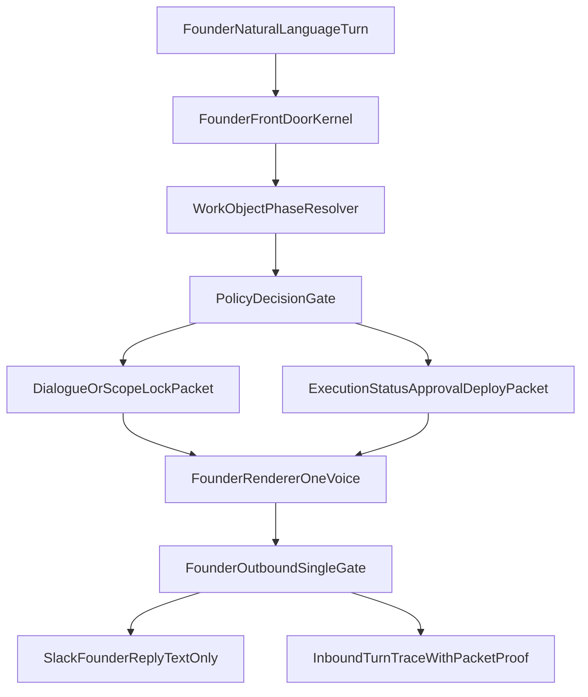

# Founder Gold SSOT One-Shot Big-Bang Hardened Plan

## 목표

- Founder-facing 경로를 사용자 SSOT 계약으로 강제 고정
- `입구 1개 / 화자 1개 / 출구 1개 / fail-closed`를 구조적으로 구현
- 문장 품질(고품질 dialogue)과 상태 전이(운영 트랜잭션)를 동시에 만족
- one-shot은 부분 보수 금지, clean rebuild 기준으로 수행

## 타겟 아키텍처 (one-shot)

## Non-Negotiable 강화 항목 (A~H 반영)

- **A Hard fallback 제한**
  - 허용은 3가지뿐: `Invariant breach`, `Unsupported founder intent`, `Runtime/system failure`
  - 금지 프롬프트에서 fallback 금지: `버전`, meta debug 2종, kickoff/follow-up/status/scope lock/approval/deploy
  - safe mode 재시도 유도 문구(한 번 더 보내달라 등) 금지
- **B Founder 경로 참조 단절**
  - founder kernel import/call chain에서 아래 0회: `runCouncilMode`, `renderDeliberation`, `tryExecutiveSurfaceResponse`, `resolveCleanStartProjectKickoff`, `runInboundAiRouter`
  - `runInboundCommandRouter`는 founder structured/query에 한정
- **C Dialogue Mode 질 강화**
  - 반박 가능, trade-off 설명, 대안 1~2개, 범위 절삭을 필수 의무로 계약화
- **D 테스트 강화**
  - exact prompt 외에 동일 프롬프트 10회 반복 안정성 + 혼합 순서 테스트 필수
- **E Clean rebuild 규칙**
  - dirty worktree 부분패치 접근 금지, clean branch/worktree에서 founder front-door 세트 재구축
- **F Runtime provenance canary**
  - startup에 `git_sha/hostname/pid/instance_id/founder_route_mode/canary_render_class/started_at` 강제 로그
- **G 문서 동기화 후순위**
  - 코드+테스트+evidence 통과 후 마지막 단계에만 문서 반영
- **H v1.1 thin pipeline 비계승**
  - 이번 one-shot은 thin pipeline + legacy passthrough를 계승하지 않음

## 하드 금지 규칙

- founder-facing council 출력 경로
- founder-facing generic clarification
- founder-facing command 유도 문구/queue promotion 제안 문구
- post-hoc regex salvage로 봉합
- legacy 래핑으로 founder text generation 유지

## 구현 범위 (재구축/격리/보존)

- **재구축 코어**
  - [/Users/hyunminkim/g1-cos-slack/app.js](/Users/hyunminkim/g1-cos-slack/app.js)
  - [/Users/hyunminkim/g1-cos-slack/src/core/founderRequestPipeline.js](/Users/hyunminkim/g1-cos-slack/src/core/founderRequestPipeline.js)
  - [/Users/hyunminkim/g1-cos-slack/src/core/cosDialogueWriter.js](/Users/hyunminkim/g1-cos-slack/src/core/cosDialogueWriter.js)
  - [/Users/hyunminkim/g1-cos-slack/src/core/founderConversationContracts.js](/Users/hyunminkim/g1-cos-slack/src/core/founderConversationContracts.js) (신규)
  - [/Users/hyunminkim/g1-cos-slack/src/core/founderHardFailRules.js](/Users/hyunminkim/g1-cos-slack/src/core/founderHardFailRules.js) (신규)
  - [/Users/hyunminkim/g1-cos-slack/src/core/founderRenderer.js](/Users/hyunminkim/g1-cos-slack/src/core/founderRenderer.js)
  - [/Users/hyunminkim/g1-cos-slack/src/core/founderOutbound.js](/Users/hyunminkim/g1-cos-slack/src/core/founderOutbound.js)
- **격리/축소 대상**
  - [/Users/hyunminkim/g1-cos-slack/src/features/runInboundAiRouter.js](/Users/hyunminkim/g1-cos-slack/src/features/runInboundAiRouter.js)
  - [/Users/hyunminkim/g1-cos-slack/src/features/runInboundCommandRouter.js](/Users/hyunminkim/g1-cos-slack/src/features/runInboundCommandRouter.js)
  - [/Users/hyunminkim/g1-cos-slack/src/features/topLevelRouter.js](/Users/hyunminkim/g1-cos-slack/src/features/topLevelRouter.js)
  - [/Users/hyunminkim/g1-cos-slack/src/features/tryExecutiveSurfaceResponse.js](/Users/hyunminkim/g1-cos-slack/src/features/tryExecutiveSurfaceResponse.js)
- **보존/연결 대상**
  - [/Users/hyunminkim/g1-cos-slack/src/features/projectIntakeSession.js](/Users/hyunminkim/g1-cos-slack/src/features/projectIntakeSession.js)
  - [/Users/hyunminkim/g1-cos-slack/src/features/projectSpaceRegistry.js](/Users/hyunminkim/g1-cos-slack/src/features/projectSpaceRegistry.js)
  - [/Users/hyunminkim/g1-cos-slack/src/features/projectSpaceBootstrap.js](/Users/hyunminkim/g1-cos-slack/src/features/projectSpaceBootstrap.js)
  - [/Users/hyunminkim/g1-cos-slack/src/features/executionRun.js](/Users/hyunminkim/g1-cos-slack/src/features/executionRun.js)
  - [/Users/hyunminkim/g1-cos-slack/src/features/executionDispatchLifecycle.js](/Users/hyunminkim/g1-cos-slack/src/features/executionDispatchLifecycle.js)
  - [/Users/hyunminkim/g1-cos-slack/src/features/executionOutboundOrchestrator.js](/Users/hyunminkim/g1-cos-slack/src/features/executionOutboundOrchestrator.js)
  - [/Users/hyunminkim/g1-cos-slack/src/features/executionSpineRouter.js](/Users/hyunminkim/g1-cos-slack/src/features/executionSpineRouter.js)

## SSOT 계약을 코드로 박는 방법

- **Mode A: COS Dialogue Mode**
  - kickoff/follow-up 슬롯: 재정의/문제유형/벤치마크축/MVP in-out/리스크/질문 3~5/next-step
  - 반박/트레이드오프/대안/범위 절삭 필수
  - generic clarification 생성 금지 + outbound 하드차단
- **Mode B: Harness Orchestration Mode**
  - scope lock 승인 후에만 진입
  - packet 기반: project space/run/workstream/provider truth/blocker/founder next action
- **Conversation ownership**
  - kickoff 감지 즉시 intake ownership 생성
  - 동일 스레드 follow-up은 continuation으로 강제
  - drift/unrelated utility 이탈 차단

## 테스트/게이트 (one-shot 통과 조건)

- founder route council 0회
- generic clarification 0회
- exact prompt gold tests 전부 통과
- 동일 프롬프트 10회 반복 시 동일 surface class + 동일 contract slots
- mixed-sequence(버전→kickoff→버전→followup→meta→status→kickoff) route leakage 0회
- scope lock 전: 고품질 dialogue 계약 충족
- scope lock 후: deterministic orchestration handoff + packet/proof/trace 연결
- 핵심 테스트 파일:
  - [/Users/hyunminkim/g1-cos-slack/scripts/test-vnext10-leak-path-council-hard-block.mjs](/Users/hyunminkim/g1-cos-slack/scripts/test-vnext10-leak-path-council-hard-block.mjs)
  - [/Users/hyunminkim/g1-cos-slack/scripts/tests-constitutional/test-founder-gold-spec-v1.mjs](/Users/hyunminkim/g1-cos-slack/scripts/tests-constitutional/test-founder-gold-spec-v1.mjs)
  - founder exact acceptance 신규 테스트(반복/혼합 순서 포함)

## 로그/증거 요구사항

- startup provenance canary 필수:
  - `git_sha`, `hostname`, `pid`, `instance_id`, `founder_route_mode`, `canary_render_class`, `started_at`
- founder turn trace 필수:
  - `input_text`, `intent`, `work_phase`, `intake_session_id`, `responder`, `surface_type`
  - `passed_pipeline`, `passed_renderer`, `passed_outbound_validation`, `legacy_router_used`, `hard_fail_reason`

## 실행 순서 (one-shot)

1. clean branch/worktree 확보
2. founder kernel 계약 파일 신설 + 기존 thin passthrough 제거
3. app.js + founderRequestPipeline 재구성 (legacy 참조 단절)
4. dialogue contracts + hard fail rules + ownership continuity 구현
5. scope lock -> run/project space/workstream handoff 연결
6. 반복/혼합 순서 acceptance 및 canary/trace evidence 확보
7. 통과 후 마지막으로 문서 동기화

## 문서 동기화 (마지막 단계만)

- [/Users/hyunminkim/g1-cos-slack/docs/cursor-handoffs/COS_Founder_Front_Door_Reconstruction_Roadmap_2026-04-01.md](/Users/hyunminkim/g1-cos-slack/docs/cursor-handoffs/COS_Founder_Front_Door_Reconstruction_Roadmap_2026-04-01.md)
- [/Users/hyunminkim/g1-cos-slack/docs/cursor-handoffs/COS_Inbound_Routing_Current_260323.md](/Users/hyunminkim/g1-cos-slack/docs/cursor-handoffs/COS_Inbound_Routing_Current_260323.md)

## Merge Gate

- founder route council 0회
- generic clarification 0회
- exact prompt acceptance + 반복 10회 + mixed-sequence 통과
- run/provider truth/handoff 회귀 없음
- startup canary + founder trace evidence 첨부
- 위 통과 전 문서 동기화/정합 보고 금지

## 마지막 원칙

이번 패치는 기능 추가가 아니라 경로 제거 + 계약 고정이다.  
대표가 들어가는 문부터 다시 세우고, 뒤쪽 orchestration spine은 살리되 founder front door는 단일 kernel/one-voice/fail-closed로 재구축한다.
